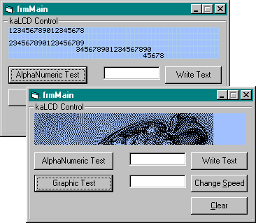

## LCD Control \(Update\)

### Description

a Liquid Character Display with the ability to display a picture too. check out picture. Some Bugs fixed and the ability to load an external "charset" from a bitmap (2 included samples. 1 with 126 chars and the other with 255 chars).

Any feedback is welcome (good and bad).

If u fix a nice charset for it i'd like to have it so it might be included in next releases.

Please vote for the original posting at

http://www.planet-source-code.com/vb/scripts/ShowCode.asp?txtCodeId=32233&lngWId=1
 
### More Info
 

             |
---                |---
**Submitted On**   |2002-03-19 19:59:04
**By**             |[Killer Angel](https://github.com/Planet-Source-Code/PSCIndex/blob/master/ByAuthor/killer-angel.md)
**Level**          |Intermediate
**User Rating**    |4.9 (34 globes from 7 users)
**Compatibility**  |VB 6\.0
**Category**       |[Custom Controls/ Forms/  Menus](https://github.com/Planet-Source-Code/PSCIndex/blob/master/ByCategory/custom-controls-forms-menus__1-4.md)
**World**          |[Visual Basic](https://github.com/Planet-Source-Code/PSCIndex/blob/master/ByWorld/visual-basic.md)
**Archive File**   |[LCD\_Contro634433192002\.zip](https://github.com/Planet-Source-Code/killer-angel-lcd-control-update__1-32839/archive/master.zip)

